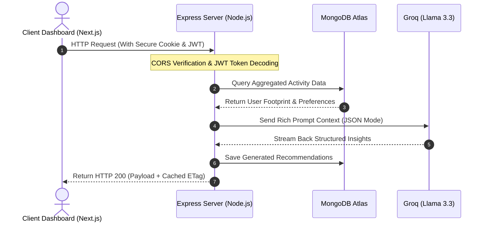

# 🌌 CarbonSphere AI

### Empowering individuals and organizations with AI-driven, actionable sustainability intelligence.

---

[](https://nextjs.org/)
[](https://www.typescriptlang.org/)
[](https://www.mongodb.com/atlas)
[](https://groq.com/)
[](https://expressjs.com/)
[](https://tailwindcss.com/)

---

## 🌐 Live Demo & Deployment Status

Experience the platform live in production:

*   **Frontend Dashboard:** [https://carbon-sphere-ai.vercel.app/](https://carbon-sphere-ai.vercel.app/) (Hosted on **Vercel**)
*   **Backend REST API:** [https://carbonsphere-ai-production.up.railway.app/](https://carbonsphere-ai-production.up.railway.app/) (Hosted on **Railway**)
*   **Database Cluster:** **MongoDB Atlas** (Shared Serverless Cluster)
*   **System Status:** `Active` 🟢 (Health check endpoint `/api/health` monitored)

---

## 📌 Problem Statement

Global climate initiatives suffer from several structural roadblocks when implemented at individual or organizational levels:

1.  **The Actionability Gap:** Traditional carbon calculators provide users with static raw data (e.g., *"Your footprint is 1.2 tCO₂e"*). This data lacks context, leaving users with no clear path to lower it.
2.  **Information Overload:** Existing suggestions are generic and fail to adjust to a user's geographical location, actual daily routine, dietary restrictions, or transport habits.
3.  **Engagement Decay:** Users quickly abandon tracking when there are no milestones, feedback loops, or community validation mechanism.
4.  **Prediction Deficit:** Without forecasting, users cannot visualize the long-term impact of their immediate adjustments, preventing proactive environmental strategies.

---

## 💡 The Solution

**CarbonSphere AI** is a state-of-the-art ESG management and carbon tracking platform that converts raw environmental logs into highly personalized, AI-driven abatement plans. 

### Key Innovation:
Instead of static lookups, CarbonSphere AI uses a **dynamic sustainability intelligence engine** powered by **Groq (Llama 3.3 70B)**. It processes real-time activity logs, runs weighted linear regression models to project future emissions, runs scenario simulations, and auto-generates adaptive weekly actions that adjust dynamically as the user changes their routine.

---

## 🚀 Key Features

### 🧠 AI Coach
*   **What it does:** Performs semantic analysis on user activity trends, generates monthly executive summaries, isolates major emissions categories, and drafts a custom weekly roadmap.
*   **Why it matters:** Users receive direct, personalized priorities instead of filtering through spreadsheets.
*   **Technical Implementation:** Node service aggregates user's activity logs and prompts Llama 3.3 via a structured JSON-mode schema to output structured markdown plans.

### 💬 AI Assistant
*   **What it does:** Provides a persistent, context-aware chatbot trained on the user's carbon footprint data.
*   **Why it matters:** Answers specific inquiries (e.g., *"How much carbon do I save if I take the train instead of driving today?"*).
*   **Technical Implementation:** Next.js UI using SSE streams connecting to a backend controller populated with recent user stats and active forecast metrics.

### 📝 Carbon Tracking
*   **What it does:** Supports high-fidelity carbon logging across 6 categories: Transport, Energy, Food, Shopping, Waste, and Water.
*   **Why it matters:** Simplifies daily logging while converting distinct metrics (e.g., miles driven, therms burned) into uniform metric tons of CO₂ equivalent (tCO₂e).
*   **Technical Implementation:** Schema-driven Mongoose model mapping inputs to specific conversion coefficients directly on save.

### 📈 Forecasting Engine
*   **What it does:** Predicts a user's emissions trajectory up to 6 months into the future.
*   **Why it matters:** Provides a baseline reference showing where the user is heading if no action is taken.
*   **Technical Implementation:** Express-based regression module executing time-decay weighted linear regressions on historical data points.

### 🕹️ Sustainability Simulator
*   **What it does:** Allows users to drag-and-drop structural lifestyle changes (e.g., installing solar panels, replacing a gasoline car with an EV) to see projected reductions.
*   **Why it matters:** Demonstrates financial and ecological ROI prior to capital outlay.
*   **Technical Implementation:** Client-side sandbox executing mathematical calculations dynamically overlaying baseline trajectories.

### 🏆 Challenges & Achievements
*   **What it does:** Gamifies the carbon reduction journey via category-specific goals (e.g., "Meatless Week") and unlockable achievements.
*   **Why it matters:** Retains user interest and leverages social competition to drive sustainability.
*   **Technical Implementation:** Trigger-based backend validators checking activity log thresholds upon daily updates.

### 🛒 Offset Marketplace
*   **What it does:** Integrates a verified catalog of carbon offset initiatives (e.g., reforestation, wind farms) where users can "purchase" credits to balance their footprint.
*   **Why it matters:** Closes the loop on emissions that cannot be directly reduced.
*   **Technical Implementation:** Backend model mapping purchases to users, incrementing `totalCarbonSaved` statistics.

### 📄 Impact Reports
*   **What it does:** Automatically compiles monthly ESG scorecards and category metrics.
*   **Why it matters:** Ready for submission to corporate compliance partners or personal archival.
*   **Technical Implementation:** Client-side HTML-to-Canvas rendering exporting A4 portrait PDFs via `jsPDF` at 2x scale.

---

## 🤖 AI Capabilities

CarbonSphere AI integrates the **Groq SDK** utilizing Llama 3.3 70B to power its intelligence layer:

```
[User Action Logs] ---> [Mongoose Aggregator] ---> [Groq Prompt Builder] ---> [Llama 3.3 70B] ---> [Structured JSON Output] ---> [AI Coach/Assistant UI]
```

*   **Multi-Key Failover Loop:** To prevent rate limiting and key exhaustion during high-concurrency periods, the backend utilizes a round-robin API key distribution cycle. If a key fails or encounters rate limits, the loop transparently switches to the next available token.
*   **Context Injection:** Prompt templates inject the user's localized settings, carbon averages, active forecasts, and challenge history, preventing the AI from generating generic advice.
*   **JSON-Schema Conformance:** System prompts dictate strict JSON response configurations which are validated prior to client delivery, securing UI element integrity.

---

## 📊 Forecasting Engine Methodology

The forecasting module does not rely on random values. It implements a mathematically rigorous **Weighted Linear Regression** with time-decay heuristics:

1.  **Weighted Data Points:** Historical data is weighted using a linear multiplier $(i + 1)$, meaning recent months have a greater impact on the slope than older months.
2.  **Granular Fallbacks:**
    *   *If 1 month of data exists:* The engine aggregates daily logs, estimates a daily slope, and extrapolates it to 30 days.
    *   *If 1 day of data exists:* The engine falls back to a category-specific growth vector (e.g., 5% baseline transport increase).
3.  **Active Deduction Engine:** When projecting 3-month and 6-month horizons, the algorithm query-intersects the database for active sustainability commitments, subtracting their expected savings from the projected emissions line:
$$\text{Projected}_t = (\text{Intercept} + \text{Slope} \times t) - \text{ActiveReduction}$$

---

## 🏗️ System Architecture

The following diagram illustrates the flow of data across the three primary layers of CarbonSphere AI:



---

## 💻 Tech Stack

### Frontend
*   **Framework:** Next.js 15 (App Router, Client-side Navigation)
*   **Runtime UI:** React 19, TypeScript
*   **Styling:** TailwindCSS, TailwindCSS-Animate, lucide-react
*   **Visualizations:** Recharts (Fully customized for dark mode compatibility)
*   **Component Library:** shadcn/ui (Radix primitives)

### Backend
*   **Routing & Framework:** Express.js 5.x
*   **Logger:** Winston Logger (Configured with file rotators and console prints)
*   **Security Primitives:** Helmet, Express Rate Limit, Cookie Parser, bcryptjs

### Database
*   **Storage:** MongoDB Atlas
*   **ORM:** Mongoose (Using compound index definitions for optimized lookup paths)

### Testing Suite
*   **Frontend Unit:** Vitest & React Testing Library
*   **End-to-End & Smoke:** Playwright (Including accessibility testing using `@axe-core/playwright`)
*   **Backend Integration:** Vitest & Supertest

---

## 🔒 Security Operations

*   **Secure Session Transport:** Authentication is managed using HTTP-Only cookies. In production, cookies enforce `SameSite=None` and `Secure=true` headers to ensure compatibility across decoupled client-server environments.
*   **CORS Protection:** Dynamic origin validation evaluates the `Origin` header against a whitelist, explicitly permitting local development environments, production hostnames, and Vercel preview domains (`*.vercel.app`).
*   **Access Rate Limiting:** Enforces strict limits:
    *   *Global API API Limits:* 100 requests per 15 minutes.
    *   *Auth Endpoint Limits:* 5 requests per 15 minutes on `/api/auth/login` and `/api/auth/register`.
*   **Fail-Safe Startup Verification:** The backend process checks for the existence of `JWT_SECRET` and MongoDB connection paths on startup, terminating instantly if security parameters are missing.

---

## 🧪 Testing Coverage

The repository includes a comprehensive testing matrix to ensure stability across deployments:

```bash
# Execute frontend unit & component tests (Vitest)
pnpm test

# Execute Playwright E2E & automated accessibility audits
pnpm test:e2e

# Execute backend integration tests (Vitest + MongoDB Memory Server)
cd backend && npm run test
```

### Verified Test Suites:
1.  **Frontend Cards:** Validation of `AIInsightCard.test.tsx`, `CarbonScoreCard.test.tsx`, `GoalProgressCard.test.tsx` (Component validation).
2.  **Playwright Smoke & Auth:** Integration testing covering registration, session validation, and layout routing.
3.  **Axe Accessibility Auditing:** Playwright-based checks to ensure the application conforms to WCAG 2.1 AA benchmarks.
4.  **Backend Integration Specs:** Endpoint verification across `auth.test.js`, `forecast.test.js`, `simulator.test.js`, and `activity.test.js`.

---

## ⚡ Performance Optimizations

*   **In-Flight Request Deduplication:** The frontend `apiClient` uses a custom caching utility (`apiCache.ts`) that maps pending requests. Multiple simultaneous requests to the same endpoint share the same promise, preventing server flooding.
*   **Mongoose Index Optimization:** Database queries utilize compound indexes to prevent full collection scans:
    *   `ActivitySchema.index({ userId: 1, date: -1 })` (Optimizes history sorting)
    *   `ActivitySchema.index({ userId: 1, category: 1 })` (Optimizes categories grouping)
*   **Next.js Route Optimization:** Employs Route Handlers and optimized client bundle routing. Next.js statically pre-renders all dashboard subpages, reducing Time to Interactive (TTI).

---

## ⚙️ Local Development Setup

Follow these steps to run CarbonSphere AI on your local machine:

### 1. Clone & Install Dependencies
```bash
git clone https://github.com/hetpatel1b/CarbonSphere-AI.git
cd CarbonSphere-AI
pnpm install
```

### 2. Configure Environment variables
Create a `.env.local` file in the root directory:
```env
NEXT_PUBLIC_API_URL="http://localhost:5000/api"
```

Create a `.env` file in the `backend/` directory:
```env
PORT=5000
MONGODB_URI="mongodb://localhost:27017/carbonsphere"
JWT_SECRET="use_a_strong_random_signing_key_here"
FRONTEND_URL="http://localhost:3000"
GROQ_API_KEY_1="your_groq_api_key_1"
```

### 3. Initialize & Seed Database
Seed achievements and challenge templates:
```bash
cd backend
npm run seed:challenges
npm run seed:achievements
cd ..
```

### 4. Start Development Servers
Run the backend server:
```bash
cd backend && npm run dev
```

Run the Next.js frontend (in a separate terminal):
```bash
pnpm dev
```

---

## 📸 Screenshots

*Below are placeholder paths representing UI features:*

*   **Dashboard Overview:** `/assets/screenshots/dashboard_mock.png`
*   **Emissions Forecasting:** `/assets/screenshots/forecasting_mock.png`
*   **AI Coach Insights:** `/assets/screenshots/ai_coach_mock.png`
*   **Offset Registry:** `/assets/screenshots/marketplace_mock.png`
*   **Impact Report Generator:** `/assets/screenshots/reports_mock.png`

---

## 🔮 Future Roadmap

1.  **Distributed Caching:** Add Redis to synchronize API rate limiting variables and cache database counts globally.
2.  **Team workspaces:** Allow multiple users to aggregate data under a corporate profile.
3.  **Vector DB Cache:** Introduce Pinecone or PGVector to cache LLM recommendations for recurring carbon categories, minimizing Groq costs.

---

## 📄 License & Contributors

*   **License:** Distributed under the MIT License. See [LICENSE](file:///d:/Het/CarbonSphere-AI/LICENSE) for more information.
*   **Contributors:** Developed by [Het Patel](https://github.com/hetpatel1b) and open-source contributors.
